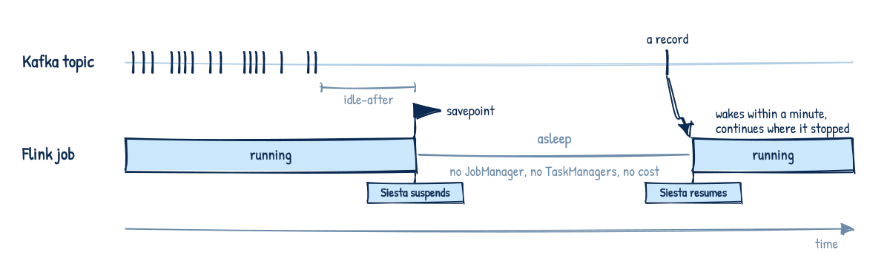

# Flink Siesta

A Kubernetes controller that suspends idle Flink jobs and resumes them when data arrives.

  <picture>
    <source media="(prefers-color-scheme: dark)" srcset="docs/siesta-dark.svg">
    
  </picture>

The Flink Kubernetes Operator can suspend a running job and later restore it from its savepoint: set `spec.job.state` to `suspended` and back to `running` on the FlinkDeployment. It is a manual step, and the operator has no notion of "this job has had no input for two weeks". Siesta watches the Kafka topics a job consumes and flips that switch on evidence. The operator does the savepoint, the teardown and the restore. Siesta only decides when.

It is for streaming jobs whose input is bursty or dormant for days: development and test environments, per-tenant pipelines, change-data-capture from systems that only change during business hours. It is not for latency-sensitive jobs, since a resume takes a restore from savepoint plus pod scheduling, one to a few minutes.

## Quick start

    helm install siesta oci://ghcr.io/patrk/charts/flink-siesta --version 0.3.0 \
      --set kafka.bootstrapServers=... --set kafka.securityProtocol=SASL_SSL \
      --set kafka.sasl.existingSecret=kafka-auth

Annotate one deployment. Nothing else changes about it.

    metadata:
      annotations:
        siesta.flink.io/mode: auto
        siesta.flink.io/sources: orders
        siesta.flink.io/idle-after: 2h

Two hours after the last record on `orders`, `kubectl describe flinkdeployment` shows `Suspended  no input for 2h0m0s` and the pods are gone. Produce one record, and within a minute or two it shows `Resumed  input observed` and the job continues from its savepoint. To watch without letting the controller act, install with `--set config.dryRun=true` first: the reason annotation then says what it would have done.

## What it does, and does not

- Suspends through the operator, with a savepoint, so the Kafka source continues exactly where it stopped. It never changes a job's `upgradeMode`, and it refuses to suspend a `stateless` job.
- Acts only on deployments you annotate, and only from evidence: no new offsets for the idle window, and, if you ask for it, the consumer group caught up or the job itself reporting nothing left to do.
- Keeps two annotations on the deployment and one small ConfigMap next to it. No CRD, no database, no metrics pipeline in the control path.
- Restarts failing jobs within a budget, and stops with an event when the budget is gone.
- Watches Kafka only, in application mode only. One controller per namespace and Kafka cluster, since two would share one lease and one set of ConfigMap names.

## Read on

- [Concepts](docs/concepts.md): how a decision is made, the annotations, what the controller remembers.
- [Install](docs/install.md): requirements and versions, chart values, Kafka credentials, network policy, GitOps, upgrading.
- [Operations](docs/operations.md): every event and what it means, metrics, the dashboard and alerts, limits.
- [Development](docs/development.md) and the [decision records](docs/adr/).
- [Changelog](CHANGELOG.md).

## Status

0.3.x is a well-tested beta. The decision model is small and covered by a table test, every transition has been run against the real operator, and the failure modes we could think of have events or tests. What it lacks is time: it has not yet run for weeks on a real cluster with real jobs. Run it in dry-run on a development namespace first, then live on non-critical jobs. 1.0 will mean thirty days on a real cluster with more than twenty jobs and no manual intervention, and the nightly grid, chaos and soak suites green for a month. Until then the annotation contract is stable, and any change to it bumps the major version.

The mascot is a Siebenschläfer, a dormouse: Berlin neighbours of Flink's squirrel, asleep seven months a year. The artwork is original and not affiliated with the Apache Flink logo. License: Apache-2.0.
