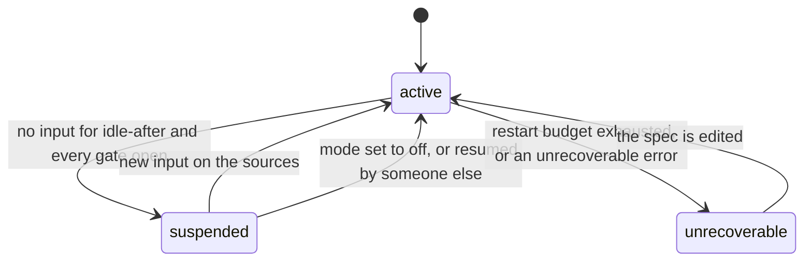
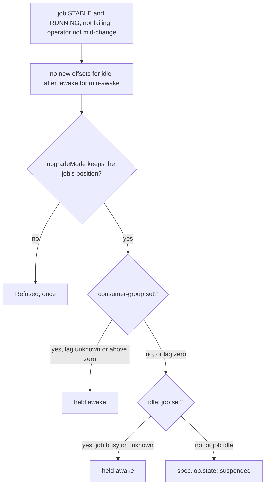

# Concepts

## What the operator offers, and what Siesta adds

The Flink Kubernetes Operator can suspend a running job and later restore it from its savepoint. You do that by setting `spec.job.state` to `suspended` and back to `running` on the FlinkDeployment, as described in the operator's [job management documentation](https://nightlies.apache.org/flink/flink-kubernetes-operator-docs-main/docs/custom-resource/job-management/). The operator has no notion of "this job has had no input for two weeks", and its autoscaler never goes below one running JobManager.

Siesta automates that step. Once a minute it reads the end offsets of the topics a job consumes with a single admin call. When nothing has moved for `idle-after`, and the job has consumed everything if you gave it the consumer group, it sets `spec.job.state: suspended`. The operator takes a savepoint and tears the job down. Your `upgradeMode` decides how, and the controller never changes it. When the offsets move, the controller sets `spec.job.state: running`, the operator restores from the savepoint, and the Kafka source continues exactly where it stopped. It also restarts failing jobs within a persisted budget.

The deployment itself carries only two annotations, its state and the reason. Everything else the controller needs to remember lives in a small ConfigMap next to the deployment.

## How a suspend is decided

A suspend has to pass a chain of gates, in a fixed order. Each gate can only say "not yet". The first one that does is named in the controller's log line and in the `siesta_held_awake` metric, and the gates after the broker's, a refusal, the consumer group and the job, write their answer as the reason on the object. Nothing on the wake side has gates: the broker's end offsets moving is the only wake signal, because a suspended job has no JobManager to ask.

Unknown never acts. A probe that could not be asked, a lag that could not be measured, a job that could not be reached: each blocks a suspend and never causes one, and none of them wakes a job.

With `consumer-group`, idle also means caught up: the group's committed offsets equal the end offsets. Flink commits those offsets only on checkpoints, so this needs checkpointing on.

With `idle: job`, the controller compares each declared partition's end offset with the last offset the job's reader emitted, which is the position a savepoint would record, and reads the source's own idle time. Records still to emit, or a record emitted within the last poll interval, hold the suspend with `job busy` on the object. An unreachable REST API holds it with `job unknown`, which is how a missing network policy shows up. This needs no consumer group, no checkpointing and no group ACL, and it never wakes a job.

Manual changes are respected. A job someone else suspends is left alone and marked `suspended outside siesta`. A job someone else resumes is treated as awake with a fresh idle window. And a dry run, `config.dryRun`, records every decision in the reason annotation without acting.

## Annotations

The prefix is configurable through `--annotation-prefix` and defaults to `siesta.flink.io`.

| Annotation | Written by | Value |
|---|---|---|
| `<prefix>/mode` | you | `auto` or `off` |
| `<prefix>/sources` | you | comma-separated topic names, or `auto` to learn them from the running job and remember them |
| `<prefix>/consumer-group` | you | optional. When set, idle also means the group has consumed everything. |
| `<prefix>/idle` | you | optional. `job` adds the running job's own view as the last gate, described above. Needs no consumer group. |
| `<prefix>/idle-after` | you | a duration such as `336h` or `14d` |
| `<prefix>/min-awake` | you | a duration, default `1h` |
| `<prefix>/restart` | you | `auto`, the default, or `off` |
| `<prefix>/bootstrap-servers` | you | reserved for a per-deployment Kafka cluster, not implemented yet. Setting it raises `InvalidPolicy`, so that implementing it later breaks nothing. |
| `<prefix>/state` | controller | `active`, `suspended` or `unrecoverable` |
| `<prefix>/reason` | controller | why it is in that state, or why it has not changed yet |

A value the controller cannot read raises `InvalidPolicy` once and the job is left untouched until you fix it. Removing the `mode` annotation releases the job: the controller removes its two annotations and the ConfigMap, with a `Released` event.

## Sources: written or learned

The written list is the default. It is a contract a human can read, it needs no access to the job, and it lets a job read a topic it should not be woken by. While a job runs, its JobManager knows which topics its Kafka sources read, and once per job instance the controller compares that with the annotation and raises `SourcesVerified`, `SourcesDrift` or, for a job without Kafka source metrics, `SourcesUnverified`. It never edits the annotation.

With `sources: auto` the controller reads the running job's Kafka topics once per job instance, remembers them in the ConfigMap, with a `SourcesLearned` event whenever the list is new or changed, and watches those. Until the job has run once under the controller nothing is known and nothing happens, and the reason says so. A job whose topics change while it sleeps wakes on the old list, and the new list is learned on that run.

Only the declared or learned sources wake a job. A job that also reads a non-Kafka source, such as a broadcast stream or a JDBC lookup, is not resumed by activity there.

## What the controller remembers

The controller's own memory, the offsets per topic, timestamps, the restart budget and the learned sources, lives in a ConfigMap named `siesta-<deployment>`. It is owned by the deployment, and every field is a plain key with a readable value, no JSON blob. Offsets are compared for equality, not for growth: a topic deleted and recreated starts at offset 0, which differs from what was remembered, so a suspended job reading it is resumed. It restores its savepoint and its Kafka source handles the out-of-range position with its reset strategy.

## Limits

These follow from what suspending a Flink job means, and Siesta cannot remove them. Processing time stops while a job is suspended: processing-time timers and windows fire late, all at once, after a resume, while event-time jobs are unaffected, so only suspend jobs whose semantics survive a pause. Group lag needs checkpointing, as above. Application mode only: a `FlinkSessionJob` has no pods of its own to take down and no lifecycle state to key on.

## Alternatives

The operator's own [autoscaler](https://nightlies.apache.org/flink/flink-kubernetes-operator-docs-main/docs/custom-resource/autoscaler/) right-sizes a running job by vertex, and KEDA with the Kafka scaler can scale the TaskManagers of a job in [reactive mode](https://nightlies.apache.org/flink/flink-docs-stable/docs/deployment/elastic_scaling/) by consumer lag. Both answer "how big should this job be while it runs". Neither reaches zero: the autoscaler keeps at least one running JobManager, and a reactive-mode job with no TaskManagers fails rather than pausing. KEDA cannot drive a FlinkDeployment directly either, because it thinks in replicas through the `/scale` subresource and a suspend is a savepoint followed by a teardown. Siesta answers the other question, "should this job be running at all", and composes with both: a job can be autoscaled while awake and suspended while idle.
